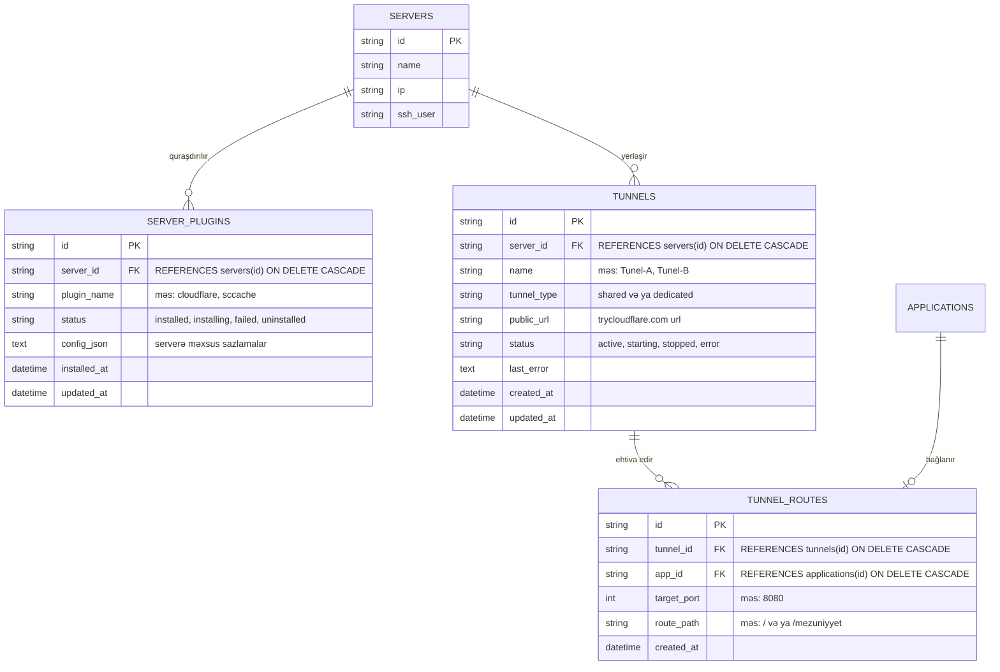

# 🗄️ Mərhələ 1: Verilənlər Bazası, Miqrasiya, Modellər, Loqlar və Testlər Planı

## 📌 Məqsəd
Verilənlər bazası dəyişikliklərini sadəcə kod daxilində deyil, professional standartlara uyğun:
1. **Ayrı SQL Miqrasiya faylları (`migrations/`)** ilə idarə etmək.
2. **Ətraflı Loqlama (`tracing` / `log`)** ilə hər bir addımı (miqrasiyanın başlaması, tətbiqi, xətaları) qeyd etmək.
3. **Avtomatlaşdırılmış Vahid və İnteqrasiya Testləri (`tests/`)** ilə bazanın bütövlüyünü və əlaqələrini təsdiqləmək.
4. **Geriyə uyğunluq (Backward Compatibility)** təmin etmək (mövcud layihələrin məlumatları pozulmamalıdır).

---

## 🏗️ Verilənlər Bazası Sxemi (ERD)

---

## 📋 Addım-Addım İcra Planı

### 1. Rəsmi SQL Miqrasiya Faylı
- **Fayl:** `MasterDeploy-rust/migrations/202609090001_add_server_plugins_and_tunnels.sql`
- **Məzmun:**
  - `CREATE TABLE IF NOT EXISTS server_plugins (...)`
  - `CREATE TABLE IF NOT EXISTS tunnels (...)`
  - `CREATE TABLE IF NOT EXISTS tunnel_routes (...)`
  - Performans üçün indekslər: `idx_tunnels_server_id`, `idx_tunnel_routes_app_id`, `idx_server_plugins_lookup`.

### 2. Rust Data Modelləri və DTO-lar
- **Fayl:** `MasterDeploy-rust/src/models.rs` (və ya `src/tunnel_models.rs`)
- **Strukturlar:**
  - `ServerPlugin`, `CreateServerPluginDto`
  - `Tunnel`, `CreateTunnelDto`, `TunnelStatus` (Enum)
  - `TunnelRoute`, `AttachRouteDto`
  - Bütün sahələr üçün `serde::Serialize`, `serde::Deserialize`, `sqlx::FromRow` atributları.

### 3. Təhlükəsiz Miqrasiya İcrası və Ətraflı Loqlar
- **Fayl:** `MasterDeploy-rust/src/db.rs`
- **İcra Mexanizmi:**
  - `sqlx::migrate!("./migrations").run(&pool).await` əmri ilə avtomatik tətbiq.
  - Hər addım üçün dəqiq loqlar:
    - `[INFO] Verilənlər bazası miqrasiyaları yoxlanılır...`
    - `[SUCCESS] Miqrasiya 202609090001 uğurla tətbiq edildi: Tunnels və ServerPlugins cədvəlləri aktivdir.`
    - `[WARN] / [ERROR]` detallı xəta mesajları və avtomatik bərpa mexanizmi.
  - Köhnə tünel məlumatlarının təhlükəsiz miqrasiyası: Əgər `applications` cədvəlində köhnə `cloudflare_url` varsa, itməməsi üçün avtomatik `tunnels` və `tunnel_routes` cədvəllərinə ilkin qeyd kimi köçürülməsi.

### 4. Avtomatlaşdırılmış Testlər (Unit & Integration Tests)
- **Fayl:** `MasterDeploy-rust/tests/tunnel_db_tests.rs`
- **Test Ssenariləri:**
  1. `test_migration_creates_tables()`: Bütün yeni cədvəllərin və indekslərin yarandığını yoxlayır.
  2. `test_create_and_query_tunnel()`: Serverə aid yeni tünel yazır, oxuyur və statusunu yeniləyir.
  3. `test_shared_tunnel_multiple_routes()`: Bir tünelə 2 fərqli layihənin (`tunnel_routes`) uğurla bağlandığını və oxunduğunu yoxlayır.
  4. `test_cascade_delete_integrity()`: Server və ya Application silindikdə tünel marşrutlarının xətasız avtomatik təmizləndiyini (`FOREIGN KEY CASCADE`) təsdiqləyir.

---
*Status: Loqlar, rəsmi miqrasiya faylı və testlər plana əlavə edildi. İcraya hazırdır.*
