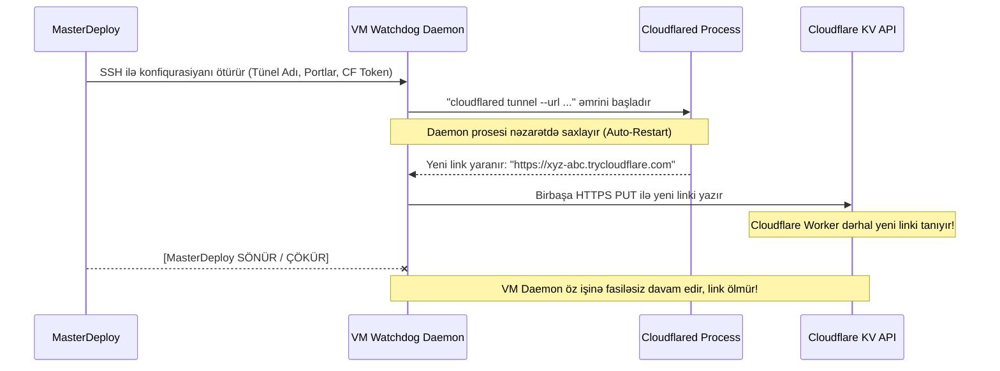

# 🤖 Mərhələ 2: Uzaq Server (VM) Daemon və Watchdog Planı

## 📌 Məqsəd
Uzaq VM-də müstəqil işləyən, MasterDeploy-dan asılı olmayan arxa plan xidməti (`md-tunnel-daemon`) yaratmaq.

---

## 🏗️ Daemon İşləmə Axını (Sequence Diagram)

---

## 📝 Görüləcək İşlər:
1. **Agent Skripti (`scripts/tunnel_agent.py` və ya shell daemon):**
   - Hər bir tünel üçün `cloudflared` prosesini başladır.
   - Loqları süzüb `trycloudflare.com` linkini tutur.
   - Cloudflare API tokenindən istifadə edərək birbaşa `api.cloudflare.com/client/v4/.../storage/kv/...` ünvanına PUT göndərir.
   - Şəbəkə qırıldıqda və ya tünel düşdükdə avtomatik təkrar qaldırır və yeni linki Cloudflare-ə çatdırır.
2. **Systemd Servis Şablonu:**
   - VM-də `md-tunnel.service` kimi quraşdırılması üçün servis konfiqurasiyası.
3. **Ortaq Tünel üçün Daxili Routing (Multi-Port):**
   - Əgər `A Tüneli`nə birdən çox layihə bağlanıbsa, VM daxilində kiçik yüngül Nginx və ya Caddy routerinin generasiya edilməsi.
