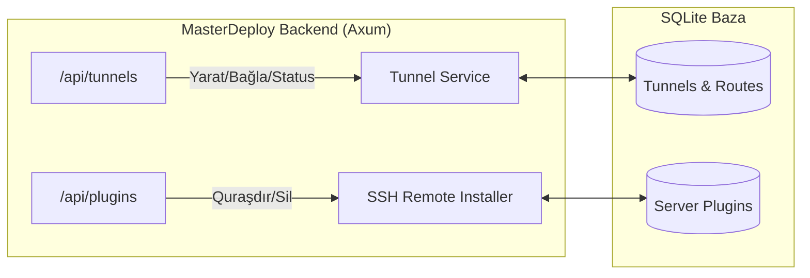

# 🔌 Mərhələ 3: Backend API və Xidmət İnteqrasiyası Planı

## 📌 Məqsəd
MasterDeploy Rust backend-ində (`cloudflare.rs`, `system.rs` və s.) tünellərin və modulların server üzrə idarə olunmasını təmin edən REST endpoint-lərini yazmaq.

---

## 🏗️ Backend Arxitekturası

---

## 📝 Görüləcək İşlər:
1. **Server-Scoped Plugin API-ləri:**
   - `POST /api/plugins/:id/install` -> `body: { server_id: "...", install_all: false }`
   - `GET /api/plugins/:id/servers` -> Hansı serverlərdə bu plugin quraşdırılıb siyahısı.
   - `POST /api/plugins/:id/uninstall` -> `body: { server_id: "..." }`
2. **Tünel İdarəetmə API-ləri:**
   - `GET /api/servers/:id/tunnels` -> Həmin VM-dəki tünellərin siyahısı (`Tunel A`, `Tunel B`).
   - `POST /api/servers/:id/tunnels` -> Yeni tünel yaratmaq (`name: "Tunel A", type: "shared/dedicated"`).
   - `POST /api/tunnels/:id/attach` -> Mövcud tünelə layihə bağlamaq (`app_id`, `target_port`, `path`).
   - `POST /api/tunnels/:id/detach` -> Tüneldən layihəni ayırmaq.
   - `GET /api/tunnels/:id/status` -> Canlı tünel statusu və URL-i.
