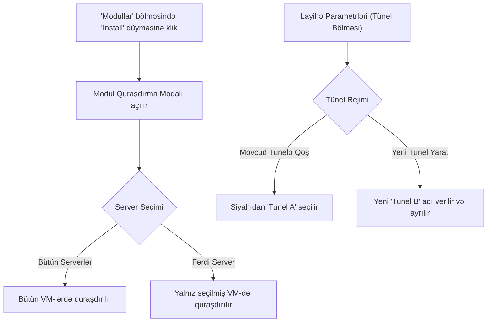

# 💻 Mərhələ 4: İstifadəçi İnterfeysi (UI) Planı

## 📌 Məqsəd
MasterDeploy veb panelində modulların quraşdırılması zamanı server seçim modalının açılması və layihə parametrlərində tünel seçimlərinin təqdim edilməsi.

---

## 🎨 UI Görünüş və Axın Dizaynı

---

## 📝 Görüləcək İşlər:
1. **Modullar Modalı (`static/modals/plugins_modal.html` & `cloudflare_plugins.js`):**
   - "Install" klikləndikdə serverlərin siyahısını göstərən seçim pəncərəsi (`Select Server`).
   - Serverlərin qarşısında quraşdırma statusunun (🟢 Quraşdırılıb / ⚪ Quraşdırılmayıb) göstərilməsi.
2. **Layihə / Tünel Paneli (`static/tabs/applications_full.html` & `app_details_module.js`):**
   - Layihənin yerləşdiyi serverdə mövcud tünellərin siyahısı açılan menyuda (`dropdown`).
   - Seçim 1: **"Mövcud tünelə qoş"** -> `[Tunel A (Aktiv)]`
   - Seçim 2: **"Yeni tünel yarat"** -> `[Adı daxil et: Məs: Tunel-B]`
   - Canlı link statusu, kopyalama düyməsi və tüneli yeniləmə/dayandırma idarəetməsi.
