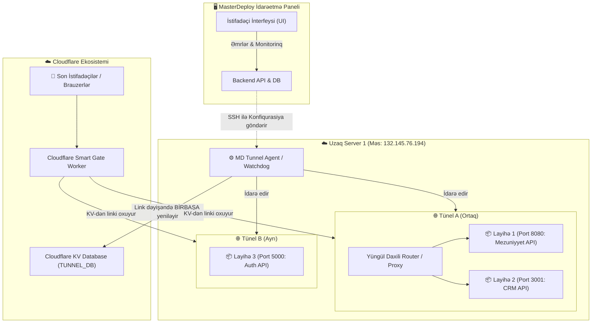

# 🌐 Müstəqil Tünel Arxitekturası və Yol Xəritəsi (Master Plan)

Bu sənəd MasterDeploy sistemində tünel idarəetməsinin qlobal və asılı modeldən tamamilə **müstəqil (decoupled), multi-node (çox serverli) və elastik** modelə keçidinin baş planını ehtiva edir.

---

## 🎯 Əsas Məqsəd və Tələblər
1. **MasterDeploy-dan Tam Müstəqillik:** MasterDeploy serveri çöksə, sönsə və ya silinsə belə, VM-lərdəki layihələr və onların tünelləri fasiləsiz işləməyə davam etməlidir.
2. **Server-Scoped Plugin Quraşdırılması:** Plugin (Modul) quraşdırılarkən istifadəçidən hansı VM-də (və ya bütün VM-lərdə) quraşdırılacağı soruşulmalıdır.
3. **Elastik Tünel Arxitekturası:**
   - **Ortaq Tünel Modeli (Shared Tunnel):** Bir VM-də bir tünel qurulur (məs. `A Tüneli`). 1-ci layihə ona bağlanır. 2-ci layihə qurulanda istifadəçi istəsə onu da həmin `A Tüneli`nə bağlayır (resurs qənaəti).
   - **Ayrı Tünel Modeli (Dedicated Tunnel):** İstifadəçi istəsə 2-ci layihə üçün tam müstəqil `B Tüneli` aça bilir (tam təcrid olunma).
4. **Avtomatik Watchdog və KV Sinxronizasiyası:** VM-dəki tünel agenti `trycloudflare.com` linki dəyişəndə birbaşa Cloudflare KV API-yə yeni linki yazır, MasterDeploy-dan asılı qalmır.

---

## 🏗️ Ümumi Arxitektura Çertyoju (Mermaid)

---

## 📋 İcra Mərhələləri və Müvafiq Plan Faylları

Bütün işlər addım-addım sənədləşdirilmiş aşağıdakı mərhələlərlə icra olunacaq:

| Mərhələ | Plan Faylı | Məzmun |
| :--- | :--- | :--- |
| **Mərhələ 1** | [01_verilenler_bazasi_ve_modeller.md](file:///e:/mezuniyyet-rust-taurisiz-olan/server-repo-rust/tunelin_deyisdirilmesi/01_verilenler_bazasi_ve_modeller.md) | Server-plugin əlaqəsi, Tünel cədvəlləri (`tunnels`, `tunnel_routes`), SQLite miqrasiyası |
| **Mərhələ 2** | [02_remote_tunnel_daemon.md](file:///e:/mezuniyyet-rust-taurisiz-olan/server-repo-rust/tunelin_deyisdirilmesi/02_remote_tunnel_daemon.md) | VM-də işləyən müstəqil Python/Shell Watchdog Daemon-u, KV birbaşa yeniləmə mexanizmi |
| **Mərhələ 3** | [03_backend_api_inteqrasiyasi.md](file:///e:/mezuniyyet-rust-taurisiz-olan/server-repo-rust/tunelin_deyisdirilmesi/03_backend_api_inteqrasiyasi.md) | Rust backend: `plugins.rs` və `cloudflare.rs`-in server-scoped və tünel-seçimli API-ləri |
| **Mərhələ 4** | [04_istifadeci_interfeysi_ui.md](file:///e:/mezuniyyet-rust-taurisiz-olan/server-repo-rust/tunelin_deyisdirilmesi/04_istifadeci_interfeysi_ui.md) | Plugin install zamanı VM seçimi modalı, Layihə yaradarkən "Mövcud tünelə qoş" və ya "Yeni tünel yarat" seçimi |
| **Mərhələ 5** | [05_test_ve_dogrulama.md](file:///e:/mezuniyyet-rust-taurisiz-olan/server-repo-rust/tunelin_deyisdirilmesi/05_test_ve_dogrulama.md) | MasterDeploy dayandırıldıqda belə uzaq VM-dəki tünellərin və API-nin canlı qalmasının yoxlanılması |

---
*Status: Planlaşdırma tamamlandı. İcraya hazırdır.*
